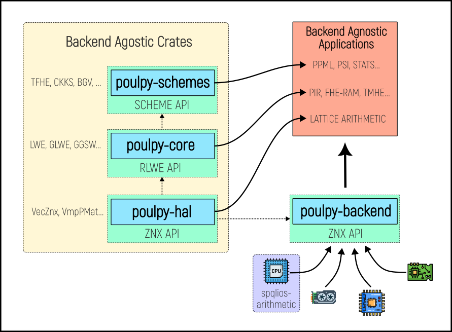

# 🐙 Poulpy

**Poulpy** is a **fast & modular** FHE library that implements Ring-Learning-With-Errors based homomorphic encryption over the Torus. It adopts the bivariate polynomial representation proposed in [Revisiting Key Decomposition Techniques for FHE: Simpler, Faster and More Generic](https://eprint.iacr.org/2023/771) to represent Torus polynomials. In addition to simpler and more efficient arithmetic than the residue number system (RNS), this representation provides a **common plaintext space** for all schemes and native bridges between any two schemes. Poulpy also decouples the schemes implementations from the polynomial arithmetic backend by being built from the ground up around a **hardware abstraction layer** that closely matches the API of [spqlios-arithmetic](https://github.com/tfhe/spqlios-arithmetic). Leveraging HAL library users can develop applications while being generic over the backend and choose any backend of choice at runtime.

## Library Crates

- **`poulpy-hal`**: a crate providing layouts and a trait-based hardware acceleration layer with open extension points, matching the API and types of spqlios-arithmetic. This crate does not provide concrete implementations other than the layouts (e.g. `VecZnx`, `VmpPmat`).
- **`poulpy-core`**: a backend agnostic crate implementing scheme agnostic RLWE arithmetic for LWE, GLWE, GGLWE and GGSW ciphertexts using **`poulpy-hal`**. Can be instantiated with any backend provided by **`poulpy-backend`**.
- **`poulpy-schemes`**: a backend agnostic crate implementing mainstream FHE schemes using **`poulpy-core`** and **`poulpy-hal`**. The crate can be instantiated with any backend provided by **`poulpy-backend`**.
- **`poulpy-backend`**: a crate providing concrete implementations of **`poulpy-hal`** for various representations and hardwares.

## Bivariate Polynomial Representation

Existing FHE implementations (such as [Lattigo](https://github.com/tuneinsight/lattigo) or [OpenFHE](https://github.com/openfheorg/openfhe-development)) use the [residue-number-system](https://en.wikipedia.org/wiki/Residue_number_system) (RNS) to represent large integers. Although the parallelism and carry-less arithmetic provided by the RNS representation provides a very efficient modular arithmetic over large-integers, it suffers from various drawbacks when used in the context of FHE. The main idea behind the bivariate representation is to decouple the cyclotomic arithmetic from the large number arithmetic. Instead of using the RNS representation for large integer, integers are decomposed in base $2^{-K}$ over the Torus $\mathbb{T}_{N}[X]$. 

This provides the following benefits:

- **Intuitive, efficient and reusable parameterization & instances:** Only the bit-size of the modulus is required from the user (i.e. Torus precision). As such, parameterization is natural and generic, and instances can be reused for any circuit consuming the same homomorphic capacity, without loss of efficiency. With the RNS representation, individual NTT friendly primes needs to be specified for each level, making the parameterization not user friendly and circuit-specific.

- **Optimal and granular rescaling:** Ciphertext rescaling is carried out with bit-shifting, enabling a bit-level granular rescaling and optimal noise/homomorphic capacity management. In the RNS representation, ciphertext division can only be done by one of the primes composing the modulus, leading to difficult scaling management and frequent inefficient noise/homomorphic capacity management.

- **Linear number of DFT in the half external product:** The bivariate representation of the coefficients implicitly provides the digit decomposition, as such the number of DFT is linear in the number of limbs, contrary to the RNS representation where it is quadratic due to the RNS basis conversion. This enables a much more efficient key-switching, which is the **most used and expensive** FHE operation. 

- **Unified plaintext space:** The bivariate polynomial representation is by essence a high precision discretized representation of the Torus $\mathbb{T}_{N}[X]$. Using the Torus as the common plaintext space for all schemes achieves the vision of [CHIMERA: Combining Ring-LWE-based Fully Homomorphic Encryption Schemes](https://eprint.iacr.org/2018/758) which is to unify all RLWE-based FHE schemes (TFHE, FHEW, BGV, BFV, CLPX, GBFV, CKKS, ...) under a single scheme with different encodings, enabling native and efficient scheme-switching functionalities.

- **Simpler implementation**: Since the cyclotomic arithmetic is decoupled from the coefficient representation, the same pipeline (including DFT) can be reused for all limbs (unlike in the RNS representation). The bivariate representation also has straight forward flat, aligned & vectorized memory layout. All these aspect make this representation a prime target for hardware acceleration.

- **Deterministic computation**: Although being defined on the Torus, bivariate arithmetic remains integer polynomial arithmetic, ensuring all computations are deterministic, the contract being that output should be reproducible and identical, regardless of the backend or hardware.

## Installation

- **`poulpy-hal`**: https://crates.io/crates/poulpy-hal
- **`poulpy-core`**: https://crates.io/crates/poulpy-core
- **`poulpy-schemes`**: https://crates.io/crates/poulpy-schemes
- **`poulpy-backend`**: https://crates.io/crates/poulpy-backend

## Documentation

* Full `cargo doc` documentation is coming soon.
* Architecture diagrams and design notes will be added in the [`/doc`](./doc) folder.

## Contributing

We welcome external contributions, please see [CONTRIBUTING](./CONTRIBUTING.md).

## Security

Please see [SECURITY](./SECURITY.md).

## License

Poulpy is licensed under the Apache-2.0 License. See [NOTICE](./NOTICE) & [LICENSE](./LICENSE).

## Acknowledgement

**Poulpy** is inspired by the modular architecture of [Lattigo](https://github.com/tuneinsight/lattigo) and [TFHE-go](https://github.com/sp301415/tfhe-go), and its development is lead by Lattigo’s co-author and main contributor [@Pro7ech](https://github.com/Pro7ech). Poulpy reflects the experience gained from over five years of designing and maintaining Lattigo, and represents the next evolution in architecture, performance, and backend philosophy.

## Citing
Please use the following BibTex entry for citing Poulpy

    @misc{poulpy,
	    title = {Poulpy v0.3.0},
	    howpublished = {Online: \url{https://github.com/phantomzone-org/poulpy}},
	    month = Oct,
	    year = 2025,
	    note = {Phantom Zone}
    }
