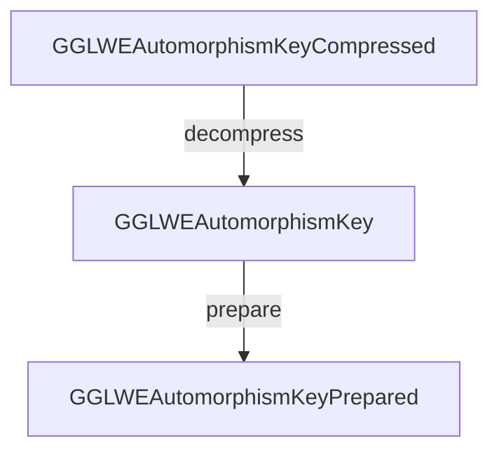

# 🐙 Poulpy-Core

**Pouly-Core** is a Rust crate that relies on **`poulpy-hal`** to provide scheme and backend agnostic RLWE-based homomorphic encryption building blocks.

## Layouts

This crates provide three types of layouts, all instantiated using the layouts of **`poulpy-hal`**. Each layout type is suited for a different purpose.
- Front-end serializable layouts, which are standard backend agnostic layouts. These are both the input and/or output of computations, for example a `GGLWEAutomorphismKey`.
- Front-end compressed serializable layouts with are a compressed variant of the standard layouts. They cannot be used for computation, but have a much smaller footprint when serialized than their standard counterpart, for example `GGLWEAutomorphismKeyCompressed`.
- Backend prepared write-only opaque layouts, which are backend specific layouts optimized for computation, for example `GGLWEAutomorphismKeyPrepared`.

Here is a flow chart illustrating the link between these types
