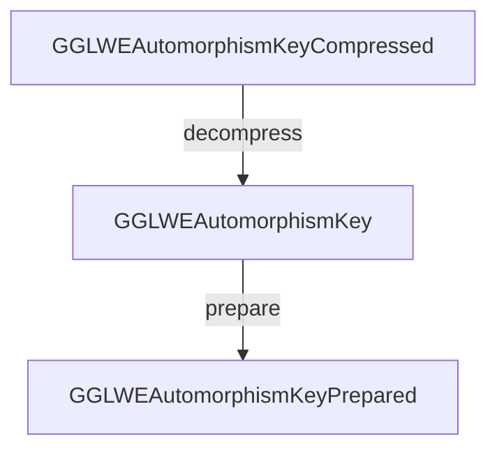

# 🐙 Poulpy-Core

**Poulpy-Core** is a Rust crate built on **`poulpy-hal`**, providing scheme- and backend-agnostic RLWE-based homomorphic encryption building blocks.

## Getting Started

```rust
use poulpy_core::{
    GLWESub, SIGMA,
    layouts::{
        Base2K, Degree, GLWE, GLWELayout, GLWEPlaintext, GLWEPlaintextLayout, GLWESecret, LWEInfos, Rank, TorusPrecision,
        prepared::GLWESecretPrepared,
    },
};
use poulpy_cpu_ref::FFT64Ref;
use poulpy_hal::{
    api::{ModuleNew, ScratchOwnedAlloc, ScratchOwnedBorrow, VecZnxFillUniform},
    layouts::{Module, ScratchOwned},
    source::Source,
};

fn main() {
    // Ring degree
    let log_n: usize = 10;

    let n: Degree = Degree(1 << log_n);

    // Base-2-k (implicit digit decomposition)
    let base2k: Base2K = Base2K(14);

    // Ciphertext Torus precision (equivalent to ciphertext modulus)
    let k_ct: TorusPrecision = TorusPrecision(27);

    // Plaintext Torus precision (equivament to plaintext modulus)
    let k_pt: TorusPrecision = TorusPrecision(base2k.into());

    // GLWE rank
    let rank: Rank = Rank(1);

    // Instantiate Module (DFT Tables)
    let module: Module<FFT64Ref> = Module::<FFT64Ref>::new(n.0 as u64);

    let glwe_ct_infos: GLWELayout = GLWELayout {
        n,
        base2k,
        k: k_ct,
        rank,
    };

    let glwe_pt_infos: GLWEPlaintextLayout = GLWEPlaintextLayout { n, base2k, k: k_pt };

    // Allocates ciphertext & plaintexts
    let mut ct: GLWE<Vec<u8>> = GLWE::alloc_from_infos(&glwe_ct_infos);
    let mut pt_want: GLWEPlaintext<Vec<u8>> = GLWEPlaintext::alloc_from_infos(&glwe_pt_infos);
    let mut pt_have: GLWEPlaintext<Vec<u8>> = GLWEPlaintext::alloc_from_infos(&glwe_pt_infos);

    // CPRNG
    let mut source_xs: Source = Source::new([0u8; 32]);
    let mut source_xe: Source = Source::new([1u8; 32]);
    let mut source_xa: Source = Source::new([2u8; 32]);

    // Scratch space
    let mut scratch: ScratchOwned<FFT64Ref> = ScratchOwned::alloc(
        GLWE::encrypt_sk_tmp_bytes(&module, &glwe_ct_infos) | GLWE::decrypt_tmp_bytes(&module, &glwe_ct_infos),
    );

    // Generate secret-key
    let mut sk: GLWESecret<Vec<u8>> = GLWESecret::alloc_from_infos(&glwe_ct_infos);
    sk.fill_ternary_prob(0.5, &mut source_xs);

    // Backend-prepared secret
    let mut sk_prepared: GLWESecretPrepared<Vec<u8>, FFT64Ref> = GLWESecretPrepared::alloc(&module, rank);
    sk_prepared.prepare(&module, &sk);

    // Uniform plaintext
    module.vec_znx_fill_uniform(base2k.into(), &mut pt_want.data, 0, &mut source_xa);

    // Encryption
    ct.encrypt_sk(
        &module,
        &pt_want,
        &sk_prepared,
        &mut source_xa,
        &mut source_xe,
        scratch.borrow(),
    );

    // Decryption
    ct.decrypt(&module, &mut pt_have, &sk_prepared, scratch.borrow());

    // Diff between pt - Dec(Enc(pt))
    module.glwe_sub_inplace(&mut pt_want, &pt_have);

    // Ideal vs. actual noise
    let noise_have: f64 = pt_want.data.stats(base2k.into(), 0).std() * (ct.k().as_u32() as f64).exp2();
    let noise_want: f64 = SIGMA;

    // Check
    assert!(noise_have <= noise_want + 0.2);
}
```

## Layouts

This crate defines three categories of layouts for `LWE`, `GLWE`, `GGLWE`, and `GGSW` objects (and their derivatives), all instantiated using **`poulpy-hal`** layouts. Each serves a distinct purpose:

* **Standard** → Front-end, serializable layouts. These are backend-agnostic and act as inputs/outputs of computations (e.g., `GGLWEAutomorphismKey`).
* **Compressed** → Compact serializable variants of the standard layouts. They are not usable for computation but significantly reduce storage size (e.g., `GGLWEAutomorphismKeyCompressed`).
* **Prepared** → Backend-optimized, opaque layouts used only for computation (write-only). These store preprocessed data for efficient execution on a specific backend (e.g., `GGLWEAutomorphismKeyPrepared`).

All **standard** and **compressed** layouts implement the `WriterTo` and `ReaderFrom` traits, enabling straightforward serialization/deserialization with any type implementing `Write` or `Read`:

```rust
pub trait WriterTo {
    fn write_to<W: Write>(&self, writer: &mut W) -> Result<()>;
}

pub trait ReaderFrom {
    fn read_from<R: Read>(&mut self, reader: &mut R) -> Result<()>;
}
```

### Example Workflow



Equivalent Rust:

```rust
let mut atk_compressed: GGLWEAutomorphismKeyCompressed<Vec<u8>> = 
    GGLWEAutomorphismKeyCompressed::alloc(...);
let mut atk: GGLWEAutomorphismKey<Vec<u8>> = 
    GGLWEAutomorphismKey::alloc(...);
atk.decompress(module, &atk_compressed);
let mut atk_prep: GGLWEAutomorphismKeyPrepared<Vec<u8>, B> = GLWESecretPrepared<Vec<u8>, B> = atk.prepare_alloc(...);
```

---

## Encryption & Decryption

* **Encryption** → Supported for all **standard** and **compressed** layouts.
* **Decryption** → Only directly available for `LWECiphertext` and `GLWECiphertext`.
  However, it remains naturally usable on `GGLWE` and `GGSW` objects, since these are vectors/matrices of `GLWECiphertext`.

```rust
let mut atk: GGLWEAutomorphismKey<Vec<u8>> =
        GGLWEAutomorphismKey::alloc(...);
atk.encrypt_sk(...);
atk.at(row, 0).decrypt(...);
```
## Keyswitching, Automorphism & External Product

Keyswitching, automorphisms, and external products are supported for all ciphertext types where they are well-defined.
This includes subtypes such as `GGLWEAutomorphismKey`.

For example:

```rust
atk.external_product(...);
ggsw.automorphism(...);
```

---

## Additional Features

* Ciphertexts: `LWE` and `GLWE`
* `GLWE` ring packing
* `GLWE` trace
* Noise analysis for `GLWE`, `GGLWE`, `GGSW`
* Basic operations over `GLWE` ciphertexts and plaintexts

---

## Tests

A fully generic test suite is available in [`src/tests/test_suite`](./src/tests/test_suite).