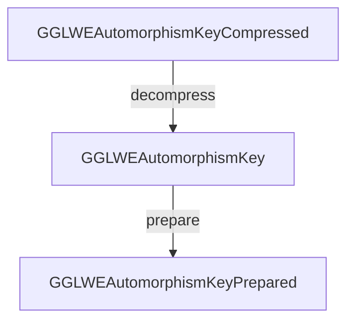

# 🐙 Poulpy-Core

**Poulpy-Core** is a Rust crate built on **`poulpy-hal`**, providing scheme- and backend-agnostic RLWE-based homomorphic encryption building blocks.

## Getting Started

`poulpy-core` is backend-agnostic. Concrete execution lives in backend crates such as
`poulpy-cpu-ref` or `poulpy-cpu-avx`, which provide the backend type `BE` used by
`poulpy_hal::layouts::Module<BE>`. The HAL remains dispatch-only: `poulpy-cpu-ref`
hosts the default implementations, while accelerated backends override selected methods.

The canonical public traits live under `poulpy_core::api::*`:

```rust
use poulpy_core::{
    api::{GLWEDecrypt, GLWEEncryptSk},
    layouts::GLWE,
};
use poulpy_hal::layouts::{Backend, Module};

fn roundtrip<BE>(module: &Module<BE>)
where
    BE: Backend,
    Module<BE>: GLWEEncryptSk<BE> + GLWEDecrypt<BE>,
{
    // Allocate GLWE operands, prepare keys, compute tmp bytes,
    // then call the safe `poulpy_core::api::*` traits through `module`
    // or the convenience methods on `GLWE`.
    let _ = module;
    let _phantom: Option<GLWE<Vec<u8>>> = None;
}
```

For a runnable end-to-end example using a concrete backend, see
`poulpy-cpu-ref/examples/core_encryption.rs`.

## Layouts

This crate defines three categories of layouts for `LWE`, `GLWE`, `GGLWE`, and `GGSW` objects (and their derivatives), all instantiated using **`poulpy-hal`** layouts. Each serves a distinct purpose:

* **Standard** → Front-end, serializable layouts. These are backend-agnostic and act as inputs/outputs of computations (e.g., `GGLWEAutomorphismKey`).
* **Compressed** → Compact serializable variants of the standard layouts. They are not usable for computation but significantly reduce storage size (e.g., `GGLWEAutomorphismKeyCompressed`).
* **Prepared** → Backend-optimized, opaque layouts used only for computation (write-only). These store preprocessed data for efficient execution on a specific backend (e.g., `GGLWEAutomorphismKeyPrepared`).

All **standard** and **compressed** layouts implement the `WriterTo` and `ReaderFrom` traits, enabling straightforward serialization/deserialization with any type implementing `Write` or `Read`:

```rust
pub trait WriterTo {
    fn write_to<W: Write>(&self, writer: &mut W) -> Result<()>;
}

pub trait ReaderFrom {
    fn read_from<R: Read>(&mut self, reader: &mut R) -> Result<()>;
}
```

### Example Workflow


```mermaid
flowchart TD
    A[GGLWEAutomorphismKeyCompressed]-->|decompress|B[GGLWEAutomorphismKey]-->|prepare|C[GGLWEAutomorphismKeyPrepared]
```

Equivalent Rust:

```rust
let mut atk_compressed: GGLWEAutomorphismKeyCompressed<Vec<u8>> = 
    GGLWEAutomorphismKeyCompressed::alloc(...);
let mut atk: GGLWEAutomorphismKey<Vec<u8>> = 
    GGLWEAutomorphismKey::alloc(...);
    module.decompress_automorphism_key(&mut atk, &atk_compressed);
let mut atk_prep = atk.prepare_alloc(module);
```

---

## Encryption & Decryption

* **Encryption** → Supported for all **standard** and **compressed** layouts.
* **Decryption** → Only directly available for `LWECiphertext` and `GLWECiphertext`.
  However, it remains naturally usable on `GGLWE` and `GGSW` objects, since these are vectors/matrices of `GLWECiphertext`.

```rust
let mut atk: GGLWEAutomorphismKey<Vec<u8>> =
        GGLWEAutomorphismKey::alloc(...);
module.glwe_automorphism_key_encrypt_sk(&mut atk, ...);
module.glwe_decrypt(&atk.at(row, 0), ...);
```
## Keyswitching, Automorphism & External Product

Keyswitching, automorphisms and external products are supported for all ciphertext types where they are well-defined.
This includes subtypes such as `GGLWEAutomorphismKey`.

For example:

```rust
module.glwe_external_product(...);
module.ggsw_automorphism(...);
```

---

## Additional Features

* Ciphertexts: `LWE` and `GLWE`
* `GLWE` ring packing
* `GLWE` trace
* Noise analysis for `GLWE`, `GGLWE`, `GGSW`
* Basic operations over `GLWE` ciphertexts and plaintexts

---

## Tests

A fully generic backend conformance suite is available in [`src/test_suite`](./src/test_suite).
Concrete backend crates instantiate it via `poulpy_core::core_backend_test_suite!`, keeping
`poulpy-core` free of any concrete backend dependency.
