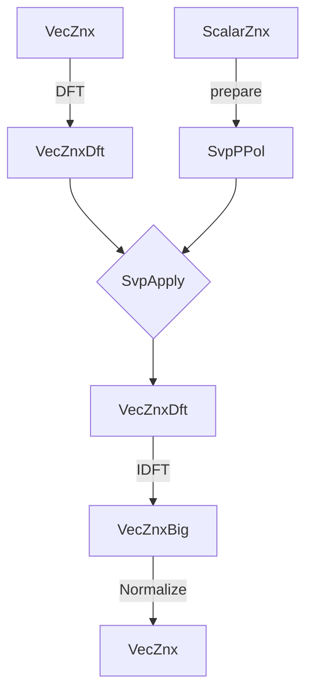

# 🐙 Poulpy-HAL

**Poulpy-HAL** is a Rust crate that provide backend agnostic layouts and trait-based low-level lattice arithmetic matching the API of [**spqlios-arithmetic**](https://github.com/tfhe/spqlios-arithmetic). This allows developpers to implement lattice-based schemes generically, with the ability to plug in any optimized backends (e.g. CPU, GPU, FPGA) at runtime.

## Crate Organization

### **poulpy-hal/layouts**

This module defines backend agnostic layouts following **spqlios-arithmetic** types. There are two main types to distinguish from: user facing types and backend types. User facing types, such as `vec_znx`, serve both as the input and output of computations, while backend types, such as `svp_ppol` (a.k.a. scalar vector product prepared polynomial), are pre-processed write-only types stored in a backend-specific representation for optimized evaluation. For example in FFT64 AVX2 CPU implementation, an `svp_ppol`, which is the prepared type of `scalar_znx`, is stored in DFT with an AVX optimized data ordering.

This module also provide various helpers over these types, as well as serialization for the front end types `scalar_znx`, `vec_znx` and `mat_znx`.

#### Module

The `module` is a struct that stores backend-specific pre-computations (e.g. DFT tables).

#### ScalarZnx

A `scalar_znx` is a front-end generic and backend agnostic type that stores a single small polynomial of `i64` coefficients. This type is mainly used to store secret-keys or small plaintext polynomials (for example GGSW plaintexts).

#### VecZnx

A `vec_znx` is a front-end generic and backend agnostic type that stores a vector of small polynomials (i.e. a vector of scalars). Each polynomial is a `limb` that provides an additional `basek`-bits of precision in the Torus. For example a `vec_znx` with `n`=1024 `basek`=2 with 3 limbs can store 1024 coefficients with 36 bits of precision in the torus. In practice this type is used for LWE and GLWE ciphertexts/plaintexts.

#### VecZnxDft

A `vec_znx_dft` is a backend-specific type that stores a `vec_znx` in the DFT domain.

#### VecZnxBig

A `vec_znx_big` is a backend-specific type that stores a `vec_znx` with big coefficient, for example the result of a scalar multiplication or a polynomial convolution. It can be mapped back to a `vec_znx` by applying a normalization step.

#### MatZnx

A `mat_znx` is a front-end generic and backend agnostic type that stores a matrix of small polynomials (i.e. a matrix of scalars). Each row of the matrix is a `vec_znx`. In practice this type is used for GGLWE and GGSW ciphertexts/plaintexts.

#### SvpPPol

An `svp_ppol` (scalar vector prepared polynomial) is a backend-specific type that stores a prepared `scalar_znx`. It is used to perform a scalar vector product which multiplies a `vec_znx` by a `scalar_znx`, typically when multiplying with a secret-key.

#### VmpPMat

A `vmp_pmat` (vector matrix product prepared matrix) is a backend-specific type that stores a prepared `mat_znx`. It is used to perform a vector matrix product which multiplies a `vec_znx` by a `mat_znx`, a typical step of the GLWE gadget product.

#### Scratch

A `scratch` is a backend agnostic scratch space manager which allows to borrows bytes or structs for intermediate computations.

---------

### **poulpy-hal/api**

This module provides the user facing traits-based API of the hardware acceleration layer. These are the traits used to implement **`poulpy-core`** and **`poulpy-schemes`**. These currently include the `module` instantiation, arithmetic over `vec_znx`, `vec_znx_big`, `vec_znx_dft`, `svp_ppol`, `vmp_pmat` and scratch space management.

---------

### **poulpy-hal/oep**

This module provides open extension points, that can be implemented to provide a concrete backend to crates implementing lattice-based arithmetic using **`poulpy-hal/api`** and **`poulpy-hal/layouts`**, such as **`poulpy-core`** and **`poulpy-schemes`** or any other project/application.

---------

### **poulpy-hal/delegates**

This module provides a link between the open extension points and public API.

---------

### Pipeline Example

## Testing

A full generic and backend agnostic testing suit for the layouts and public API is planned. This will allow to test the correctness of any backend easily.