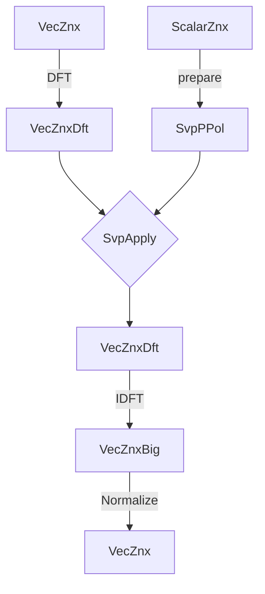

# 🐙 Poulpy-HAL

**Poulpy-HAL** is a Rust crate that provides backend-agnostic layouts and trait-based low-level lattice arithmetic. This allows developers to implement lattice-based schemes generically, with the ability to plug in optimized backends (e.g. CPU, GPU, FPGA) at runtime.

The important design point is that the public API is centered on **backend-native borrows** rather than host byte slices. Shared crates should be written against `*ToBackendRef` / `*ToBackendMut` and the corresponding `...BackendRef` / `...BackendMut` view types. This remains true even for host backends: generic HAL-facing code should still go through `ToBackendRef` / `ToBackendMut`, not `to_ref()` / `to_mut()`. Host-view helpers are only escape hatches for explicitly host-side tasks.

## Crate Organization

### **poulpy-hal/layouts**

This module defines backend-agnostic layouts. There are two main categories: user-facing types and backend types. User-facing types, such as `vec_znx`, serve as both inputs and outputs of computations, while backend types, such as `svp_ppol` (a.k.a. scalar vector product prepared polynomial), are pre-processed, write-only types stored in a backend-specific representation for optimized evaluation. For example, in the FFT64 AVX2 CPU implementation, an `svp_ppol` (the prepared form of `scalar_znx`) is stored in the DFT domain with an AVX-optimized data ordering.

This module also provides helpers over these types, as well as serialization for the front-end types `scalar_znx`, `vec_znx` and `mat_znx`.

#### Backend Model

Each backend defines:

- `OwnedBuf`: the backend-owned storage type
- `BufRef<'a>` / `BufMut<'a>`: backend-native shared and mutable borrows

This means a layout like `VecZnx<BE::OwnedBuf>` is the owned form, while:

- `VecZnxBackendRef<'a, BE>` is the shared backend-native borrow
- `VecZnxBackendMut<'a, BE>` is the mutable backend-native borrow

The generic adapter traits follow the same pattern:

- `VecZnxToBackendRef<BE>`
- `VecZnxToBackendMut<BE>`
- `VecZnxDftToBackendRef<BE>`
- `VecZnxDftToBackendMut<BE>`
- `SvpPPolToBackendRef<BE>`
- `SvpPPolToBackendMut<BE>`
- `VmpPMatToBackendRef<BE>`
- `VmpPMatToBackendMut<BE>`
- etc...

Host-visible code should construct `HostBytesBackend` views directly, either through backend-native `*ToBackendRef/*ToBackendMut` impls or the small `*_host_backend_ref/mut` helpers used by shared host utilities. Generic HAL compute code should still be written against backend views, not raw host slices.

#### Core Layouts

- `Module`: stores backend-specific precomputations such as DFT tables and handles.
- `ScalarZnx`: front-end scalar polynomial layout, mainly used for secrets and small plaintexts. Generic code typically consumes it through `ScalarZnxToBackendRef<BE>` / `ScalarZnxToBackendMut<BE>`.
- `VecZnx`: front-end vector-of-polynomials layout used for LWE/GLWE plaintexts and ciphertexts. Precision is represented by limbs in base `2^k`. Generic execution uses `VecZnxBackendRef` / `VecZnxBackendMut` via `VecZnxToBackendRef<BE>` / `VecZnxToBackendMut<BE>`.
- `MatZnx`: front-end matrix-of-polynomials layout, used for GGLWE and GGSW-style objects. Generic backends consume it through `MatZnxToBackendRef<BE>` / `MatZnxToBackendMut<BE>`.
- `VecZnxDft`: backend-specific prepared-domain representation of `VecZnx`. Its storage layout is backend-defined.
- `VecZnxBig`: backend-specific big-coefficient representation, typically used after multiplication or convolution and later normalized back into `VecZnx`.
- `SvpPPol`: backend-specific prepared form of `ScalarZnx` for scalar-vector products.
- `VmpPMat`: backend-specific prepared form of `MatZnx` for vector-matrix products.
- `ScratchArena`: backend-native scratch view over a `ScratchOwned` buffer, used to carve typed temporary storage during execution.

---------

### **poulpy-hal/api**

This module provides the user-facing traits-based API of the hardware acceleration layer. These are the traits used to implement **`poulpy-core`** and **`poulpy-schemes`**. These currently include the `module` instantiation, arithmetic over `vec_znx`, `vec_znx_big`, `vec_znx_dft`, `svp_ppol`, `vmp_pmat` and scratch space management.

At this layer, APIs are expected to be backend-generic. In practice that means:

- inputs and outputs are described via `*ToBackendRef` / `*ToBackendMut`
- prepared-domain objects (`VecZnxDft`, `SvpPPol`, `VmpPMat`, convolution prepared types) are treated as opaque backend-owned storage
- host-visible byte access is only required for explicitly host-side operations such as serialization, encoding, stats, or test/reference paths


---------

### **poulpy-hal/oep**

This module provides open extension points that can be implemented to provide a concrete backend to crates implementing lattice-based arithmetic using **`poulpy-hal/api`** and **`poulpy-hal/layouts`**, such as **`poulpy-core`** and **`poulpy-schemes`** or any other project/application. Poulpy-HAL itself is dispatch-only: default implementations live in `poulpy-cpu-ref`, and accelerated backends (e.g. `poulpy-cpu-avx`) selectively override hot paths.


---------

### **poulpy-hal/delegates**

This module provides a link between the open extension points and public API, forwarding trait calls on `Module<BE>` to `BE`'s `HalImpl`.


---------

### Pipeline Example


```mermaid
flowchart TD
    A[VecZnx] -->|DFT|B[VecZnxDft]-->E
    C[ScalarZnx] -->|prepare|D[SvpPPol]-->E
    E{SvpApply}-->VecZnxDft-->|IDFT|VecZnxBig-->|Normalize|VecZnx
```

### E2E Dispatch Example

User-facing call:

```rust
use poulpy_hal::api::VecZnxAddInto;
use poulpy_hal::layouts::Module;
use poulpy_cpu_avx::FFT64Avx;

let module = Module::<FFT64Avx>::new(1 << 12);
module.vec_znx_add_into(&mut res, 0, &a, 0, &b, 0);
```

Delegate in `poulpy-hal`:

```rust
impl<BE> VecZnxAddInto for Module<BE>
where
    BE: Backend + HalImpl<BE>,
{
    fn vec_znx_add_into<R, A, B>(&self, res: &mut R, res_col: usize, a: &A, a_col: usize, b: &B, b_col: usize)
    where
        R: VecZnxToBackendMut<BE>,
        A: VecZnxToBackendRef<BE>,
        B: VecZnxToBackendRef<BE>,
    {
        BE::vec_znx_add_into(self, res, res_col, a, a_col, b, b_col)
    }
}
```

Backend implementation (AVX keeps defaults unless it overrides):

```rust
unsafe impl HalImpl<FFT64Avx> for FFT64Avx {
    fn vec_znx_add_into<R, A, B>(
        module: &Module<Self>,
        res: &mut R,
        res_col: usize,
        a: &A,
        a_col: usize,
        b: &B,
        b_col: usize,
    )
    where
        R: VecZnxToBackendMut<Self>,
        A: VecZnxToBackendRef<Self>,
        B: VecZnxToBackendRef<Self>,
    {
        <Self as HalVecZnxDefaults<Self>>::vec_znx_add_into_default(
            module, res, res_col, a, a_col, b, b_col,
        )
    }
}
```

Defaults in `poulpy-cpu-ref`:

```rust
pub trait HalVecZnxDefaults<BE: Backend>: Backend {
    fn vec_znx_add_default<R, A, B>(
        module: &Module<BE>,
        res: &mut R,
        res_col: usize,
        a: &A,
        a_col: usize,
        b: &B,
        b_col: usize,
    )
    where
        R: VecZnxToBackendMut<BE>,
        A: VecZnxToBackendRef<BE>,
        B: VecZnxToBackendRef<BE>,
        BE: ZnxAdd + ZnxCopy + ZnxZero,
    {
        let mut res = res.to_backend_mut();
        let a = a.to_backend_ref();
        let b = b.to_backend_ref();
        reference::vec_znx::vec_znx_add_into::<BE>(&mut res, res_col, &a, a_col, &b, b_col);
    }
}
```

### Host Views vs Backend Views

As a rule of thumb:

- use `*ToBackendRef` / `*ToBackendMut` in public HAL-facing compute APIs, including when the backend itself is host-resident
- treat `to_ref()` / `to_mut()` as host-view escape hatches, not as the normal API for generic backend code

Examples of legitimate host-side use:

- serialization and deserialization
- encoding / decoding helpers
- reference arithmetic that directly manipulates `&[i64]`
- tests that compare host materialized values

Interfacing a device backend with the host should happen through backend transfer hooks such as `from_host_bytes`, `to_host_bytes`, `copy_from_host`, and `copy_to_host`, or through higher-level `upload_*` / `download_*` APIs built on top of them.

Examples of backend-native use:

- `VecZnx -> VecZnxDft`
- `ScalarZnx -> SvpPPol`
- `MatZnx -> VmpPMat`
- pointwise ops in prepared domains
- backend scratch allocation and subview carving

### Backend Interoperability

Backends are also expected to define how values move between host memory and backend-owned storage.

At the raw buffer level, every backend implements:

- `Backend::from_host_bytes`
- `Backend::to_host_bytes`
- `Backend::copy_from_host`
- `Backend::copy_to_host`

These are the fundamental upload/download hooks used to move layout storage across the host/backend boundary. For example:

```rust
let gpu_buf = CudaBackend::from_host_bytes(host_bytes);
let roundtrip = CudaBackend::to_host_bytes(&gpu_buf);
```

For cross-backend buffer transfer, `poulpy-hal` provides `TransferFrom<From>`. This is destination-owned: the destination backend declares how to import a source backend buffer.

```rust
pub trait TransferFrom<From: Backend>: Backend {
    fn transfer_buf(src: &From::OwnedBuf) -> Self::OwnedBuf;
}
```

The default implementation only covers simple host-resident `Vec<u8>` backends. Device backends are expected to add explicit impls for the source backends they support.

At the structured layout level, the canonical `upload_*` / `download_*` APIs live one layer above, in `poulpy-core::api::ModuleTransfer`. Those methods are built on top of `TransferFrom` and let modules move typed values such as `GLWE`, `LWE`, `GGLWE`, `GGSW`, and prepared keys between backends.

In practice:

- use `from_host_bytes` / `to_host_bytes` when you need a low-level buffer bridge
- use `TransferFrom` when implementing backend-to-backend storage movement
- use `ModuleTransfer::upload_*` / `download_*` in higher-level code that moves full typed objects between backends

## Tests

A fully generic cross-backend test suite is available in [`src/test_suite`](./src/test_suite).
